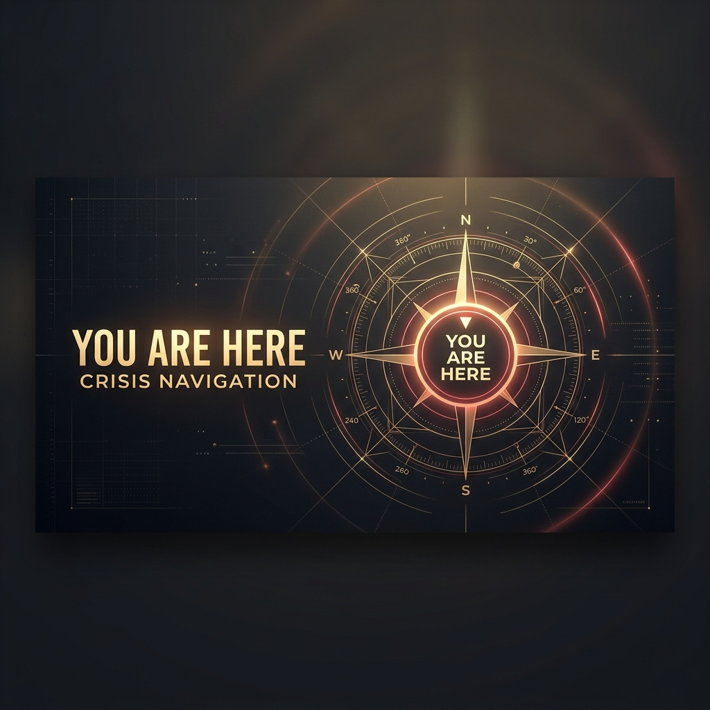

  
  
  <h1>YOU ARE HERE</h1>
  
<b>Personal Development Mirror</b>

  

    
    
  

---

### ⚠️ Mirror Notice
This repository is my **personal development branch** and "drafting space" for the *You Are Here* toolkit. While it contains the latest PDFs, please refer to the official organization repository for stable releases, citations, and community contributions.

**[➡️ Go to Official Repository](https://github.com/DodecaGoneSystems/You-Are-Here)**

---

### 🛡️ About the Toolkit
**YOU ARE HERE** is a mechanical stabilization framework. It treats cognitive load as a thermodynamic variable and provides somatic overrides to bypass compromised judgment during acute panic or overwhelm.

### 🌱 Ecosystem
- **Official Hub:** [DodecaGone Systems](https://github.com/DodecaGoneSystems)
- **Maintenance:** [I Need Maintenance](https://github.com/haskinj/i-need-maintenance)

  <code>><^</code> 
  <i>GNU Terry Pratchett</i>

